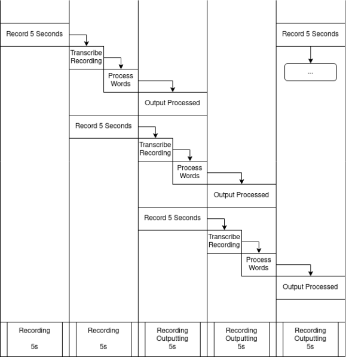

# Configurable Real Time Speech Censorship
Policing and AI

Final project for CMPSC 442 by Cole Bianchi, Dante Dodds, Kevin Dong, Nathan Litzinger, Andre Mitrik, Efe Sahin

Biggest Bird Labs, LLC

Configurable Real Time Speech Censorship utilizes OpenAI Whisper to live transcribe audio segments, identify banned words, and block their playback. This application has use cases in live streaming for hosting providers to automate terms of service enforcement for prohibitted language.

## Setup

Setup python virtual environment using Python

### Linux (Fedora)
This guide is specific to Fedora but should be adaptable to any system.

Install required dependencies using:

```
	dnf -y update && \
	dnf -y install python3 && \
	dnf -y install python3-pip && \
	dnf -y install sox && \
	dnf -y install pulseaudio && \
	dnf -y install alsa-lib alsa-utils && \
	dnf -y install portaudio portaudio-devel && \
	dnf -y install python3-pyaudio && \
	dnf -y install gcc
```

Navigate to your workspace folder and setup the virtual environment:

`virtualenv --python="/usr/bin/python" venv`

Source the environment:

`source venv/bin/activate`

Install pip requirements:

`pip install -r requirements.txt`

Run the code:

`python censor.py`

## Design and Implementation

The system is broken into three key areas: Audio aquisition, Audio Transcription, and Transcription Filtering and Playback.

### Audio Aquisition

The system uses the SoundDevice python module to recieve raw PCM data from the device's primary microphone in (by default) 4 second long frames recorded at 16000Hz. This raw data is fed into the transcription thread in 4 second long chunks.

### Audio Transcription

When new audio frames are receieved they are converted into the correct data format for OpenAI's Whisper Tiny-en model to ingest and then fed into the model. The model outputs a list of words detected in the audio frame as well as time stamps for when the words were spoken within the frame. This information is then passed to the filtering and playback thread with the original audio clip.

### Transcription Filtering and Playback

A word list is defined that includes all banned phrases. When new transcriptions are ingested the individual words are stripped of punctuation and spaces and made lowercase. The word list is then scanned for these reformatted words. If a word is found, it's time stamp is added to a list of blocked times. This list is then used to identify areas in the input audio to block out and play back.

### Dataflow

A high level of the data flow explained above can be seen here:



### Data

Whisper was trained on 680,000 hours of labeled audio from the English only and Multi-Lingual data sets shown below:

- LibriSpeech
- TED-LIUM 3
- Common Voice 5.1
- Artie bias corpus
- CallHome and Switchboard
- WSJ
- CORAAL
- CHiME-6
- AMI-IHM and AMI-SDM1
- Meanwhile
- Rev16
- Kincaid46
- Earnings-21
- Multilingual LibriSpeech
- Fleurs
- VoxPopuli
- Common Voice 9
- CoVOST 2

Of these 65% are English only datasets which shows the model's better performance and bias toward English speakers.

## Goals
What might be the goals of the intelligent system? (what we’re automating,
prerequisites, directives and plan blueprints)

This intelligent system identifies certain flagged words and phrases (transcription phase), timestamps on when those words are said within given PCM audio input. Under a set delay, our system would be reactive to the flags given and then it will perform masking/censoring for the audio snippet under question.

Sequentially, we can lay out our automated goals as such:

- Identifying all words (essentially transcribing an audio clip).
- Finding the words and ensuring to associate when they’re spoken to an instance in time to track them.
- Performing censorship based on what we’re flagging/the goal our system.

## Environment
What is the environment that the system will be adapting within? (conditions of environment, necessary contextual information, inner/outer environment
definitions)

Inner environment would be the individual word/phrase definition within the OpenAI Whisper model. Intrinsically, it would also include the list preset words that we are considering a “flag” for our timestep tracking.

Outer environment would include the words and audio adapted from the input audio stream. Given the “delay” between the stream of input audio data and the output post-censoring, it gives us time for our automated intelligence to react to the data using an algorithm instead of being constricted to prediction heuristics. This also opens up another layer of complication that
we could use in terms of how much weight to certain flagged words and phrases and how to deal with cases where we may want to react differently.

## Adaptation
How might the system adapt to the environment given the goals? How might its
inner environment change? (what constitutes a “trigger” in our system, what
conditions affect events we analyze)

The adaption itself happens from voice to voice to pick up the words based on an individuals’ unique dialect, speaking styles, etc. which will happen within the actual training phase when we train the model as opposed to the execution time. It is a primary goal of ours to include a broad training set so that our model does not get oversaturated and become biased towards recognizing only one “style” of voice.

As far as testing is concerned, some things we may need to do include:
- Acquiring many sources of audio data of various people speaking
- Potentially creating various classifications of voices to make training “simpler”
- Figuring a workaround for when some audio inputs may not be “clear”

## Citations
